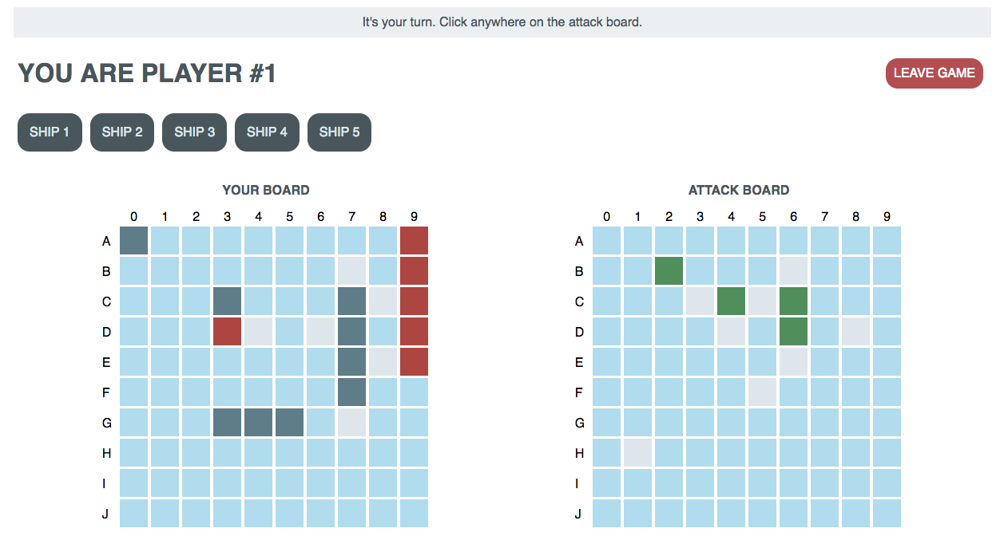

# Battleship
---
## Summary
This is a web-based multiplayer implementation of the game Battleship.

## Stack/Architecture
Frontend: Plain JS/HTML/CSS with jQuery

Backend: Java, Spring Boot, JPAA/Hibernate, and Postgres

## Project Layout
Frontend code can be found in the [resources/static](src/main/resources/static) folder. Backend routes are defined in the [controller](src/main/java/emma/battleship/controller) folder and schema definitions are in the [model](src/main/java/emma/battleship/model) folder.

Players can click beginning and end points of ships to place them.

Players take turns making moves. The player board lights up with your opponent's correct and incorrect hits, and the attack board can be clicked to make moves.

## Future Work
This project was initially implemented over the course of 3 days and was structured to allow someone to play as multiple users within the same browser (which isn't a normal use case for most games played by users on different computers). If I were to alter its structure for more typical use cases, I would expand the schema by creating a player model in order to allow players to identify themselves by a username. This would streamline the data-saving process and allow persistence upon tab refresh.
